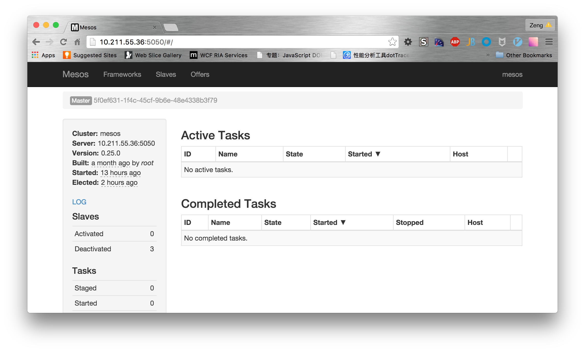

#Mesos安装指南

##单节点Mesos集群

###下载Mesos

有以下两种不同的方式获得Mesos

1. 从[Apache](http://mesos.apache.org/downloads/)下载最新稳定发布
	
	~~~
wget http://www.apache.org/dist/mesos/0.25.0/mesos-0.25.0.tar.gz
tar -zxf mesos-0.25.0.tar.gz
rm mesos-*.tar.gz
mv mesos-* mesos
	~~~
- 从Mesos git repository中Clone最新代码
	
	~~~
	git clone https://git-wip-us.apache.org/repos/asf/mesos.git
	~~~
	
###安装Mesos依赖项

####Ubuntu 14.04

~~~
#更新所有的包
sudo apt-get update
   
#安装OpenJDK
sudo apt-get install -y openjdk-7-jdk
   
#安装autotools（仅当从git clone时）
sudo apt-get install -y autoconf libtool
   
#安装其它依赖项
sudo apt-get -y install build-essential python-dev python-boto libcurl4-nss-dev libsasl2-dev maven libapr1-dev libsvn-dev
~~~
 
####CentOS 7.1
~~~
#安装辅助工具
sudo yum install -y tar wget

#安装Apache Mavven repo源
sudo wget http://repos.fedorapeople.org/repos/dchen/apache-maven/epel-apache-maven.repo -O /etc/yum.repos.d/epel-apache-maven.repo

#安装其它依赖项
sudo yum install -y apache-maven python-devel java-1.7.0-openjdk-devel zlib-devel libcurl-devel openssl-devel cyrus-sasl-devel cyrus-sasl-md5 apr-devel subversion-devel apr-util-devel
~~~

###编译Mesos

~~~shell
#进入Mesos文件夹
cd mesos

#Bootstrap（仅当从git clone时）
./bootstrap

#创建编译文件夹
mkdir build

#进入编译文件夹
cd build

#执行配置和编译
../configure
make
~~~

可以通过指定`-j <核心数目> V=0`来提高编译速度和减少日志输出

###编译示例Framework

~~~
make check
~~~

###安装Mesos

~~~
make install
~~~

###Mesos提供的命令列表

|命令|使用|
|---|---|
|mesos-local.sh|启动一个单进程内存集群|
|mesos-tests.sh|运行Mesos测试用例套件|
|mesos.sh|用于启动Mesos命令的封装脚本，不指定参数执行时输出所有可以参数列表|
|gdb-mesos-*|使用gdb以调试模式启动相关进程|
|lldb-mesos-*|使用lld以调试模式启动相关进程|
|mesos-daemon.sh|启动或者停止Mesos守护进程|
|mesos-start-cluster.sh  mesos-stop-cluster.sh|用于启动或者停止[install-prefix]/var/memsos/deploy/masters以及[intall-prefix]/var/mesos/deploy/slaves文件中定义的节点上的Mesos集群|
|mesos-start-master.sh  mesos-stop-master.sh|启动或者停止master文件中定义的节点上的mesos master|
|mesos-start-slave.sh mesos-stop-slave.sh|启动或者停止slave文件中定义的节点上的mesos slave|

###启动Mesos

1. 为Mesos replicated log创建目录，并且赋予目录读写权限

	~~~
	#创建文件夹
	sodu mkdir -p /var/lib/mesos
	
	#授权
	sudo chown `whoami` /var/lib/mesos 
	~~~
- 启动Mesos master
	
	~~~
	mesos-master --work_dir=/var/lib/mesos
	~~~
- 启动Mesos slave
  
  	~~~
  	mesos-slave --master=<master的IP或者主机名>:5050
  	~~~
  
###运行测试框架

~~~
#C++测试框架
[install-prefix]/mesos/build/src/test-framework --master=<master的IP或者主机名>:5050
	
#Java测试框架
[install-prefix]/mesos/build/src/example/java/test-framework --master=<master	的IP或者主机名>:5050
	
#Python测试框架
[install-prefix]/mesos/build/src/example/python/test-framework --master=<master的IP或者主机名>:5050
~~~
  	
###查看Mesos运行状况

可以在浏览器中输入`http://{master的IP或者主机名}:5050`来浏览Mesos提供的Web UI站点，在此站点中可以看到Mesos的运行状况。

##多节点Mesos集群

###部署ZooKeeper集群

1. 从[http://zookeeper.apahce.org]()下载最新的ZooKeeper发行版
2. 将下载的软件包拷贝到集群中的所有节点，并且解压
3. 在集群中所有节点上的ZooKeeper安装文件夹下下的conf文件夹新建一个名为zoo.cfg的配置文件，并且在配置文件中添加集群中服务器的信息

	~~~
	#新建配置文件
	cp zoo_sample.cfg zoo.cfg
	
	#添加节点信息
	server.1={节点IP或者主机名}:2888:3888
	server.2={节点器IP或者主机名}:2888:3888
	server.3={节点器IP或者主机名}:2888:3888
	...
	~~~
4. 依次启动各个节点上的ZooKeeper

	~~~
	bin/zkServer.sh start
	~~~
	
###部署Mesos master集群

1. 使用单节点相同的模式，在参与集群的所有节点上安装mesos master
2. 使用下述命令启动各个节点上的mesos master，注意需要通过`--zk`参数指定ZooKeeper服务器地址，zk服务器地址为上一节中ZooKeeper集群配置文件中配置的地址，多个地址之间使用逗号分隔。**注意：**最后一项需要指定zNode的名称，例如本例中的mesos，这个名称可以任意指定，但是master和slave指定的名称必须相同，一般默认为mesos。

	~~~
	mesos-master --zk=zk://{zk服务器IP或者主机名}:2181,{zk服务器IP或者主机名}:2181,{zk服务器IP或者主机名}:2181,.../mesos
	~~~ 
	
###启动Mesos slave集群

Mesos slave的启动方式与单节点的模式基本相同，唯一不同的是，通过`--master`参数传入的为ZooKepper服务器的地址，而不再是Mesos master的地址，配置方式与Mesos master的`--zk`参数配置方式相同。

~~~
mesos-slave --master=zk://{zk服务器IP或者主机名}:2181,{zk服务器IP或者主机名}:2181,{zk服务器IP或者主机名}:2181,.../mesos
~~~

###测试Mesos集群

##在Docker中运行Mesos集群
###准备环境变量

1. 导出主机的IP地址，后续的命令中需要使用
	
	~~~
	HOST_IP=`hostname -I | awk '{print $1}'`
	~~~
	
###启动ZooKeeper
1. 下载zookeeper镜像
	
	~~~
	docker pull mesoscloud/zookeeper:3.4.6-ubuntu-14.04
	~~~
	
2. 禁用宿主机防火墙

	~~~
	systemctl disable iptables
	systemctl stop iptables
	~~~
	
3. 启动zookeeper容器（单机模式）

   ~~~
   docker run -d \
   -p 2181:2181 \
   -p 2888:2888 \
   -p 3888:3888 \
   --restart=always \
   mesoscloud/zookeeper:3.4.6-ubuntu-14.04
   ~~~
3. 启动zookeeper容器（集群模式）   

   ~~~
   docker run -d \
   -p 2181:2181 \
   -p 2888:2888 \
   -p 3888:3888 \
   --restart=always \
   mesoscloud/zookeeper:3.4.6-ubuntu-14.04
   -e SERVERS={zkServerIP或者主机名},{zkServerIP或者主机名},{zkServerIP或者主机名},...
   ~~~
4. 检测zookeeper是否启动

	~~~
	#使用telnet连接到zookeeper
	telnet $HOST_IP 2181
	
	#在提示符后输入stat
	stat
	
	#如果有类似输出，则启动成功
	Zookeeper version: 3.4.6-1569965, built on 02/20/2014 09:09 GMT
	Clients:
	/10.211.55.36:46765[0](queued=0,recved=1,sent=0)
	Latency min/avg/max: 0/0/0
	Received: 2
	Sent: 1
	Connections: 1
	Outstanding: 0
	Zxid: 0x0
	Mode: standalone
	Node count: 4
	Connection closed by foreign host.
	~~~
	
###启动master

1. 下载master镜像

	~~~
	docker pull mesoscloud/mesos-slave:0.24.1-ubuntu-14.04
	~~~
	
2. 禁用宿主机防火墙

	~~~
	#停止防火墙服务
	systemctl disable firewalld.service
	systemctl stop firewalld.service
	
	#停止iptables
	systemctl disable iptables
	systemctl stop iptables
	
	#禁用selinux
	selinux=false
	
	#最好清除iptables的链和规则
	iptables -F
	iptables -X
	~~~
	
3. 启动master容器(可以根据在多个节点上启动多个master容器)

     ~~~
   docker run -d \
   --name=mesos-master \
   --pid=host \
   --net=host \
   --restart=always \
   -v /var/log/mesos:/var/log/mesos \
   -v /var/lib/mesos:/var/lib/mesos \
   -e MESOS_HOSTNAME=$HOST_IP \
   -e MESOS_IP=$HOST_IP \
   -e MESOS_ZK=zk://{zk服务器IP或者主机名}:2181,{zk服务器IP或者主机名}:2181,...{zk服务器IP或者主机名}:2181/mesos \
   -e MESOS_QUORUM=1 \
   -e MESOS_LOG_DIR=/var/log/mesos
   mesoscloud/mesos-master:0.24.1-ubuntu-14.04
   ~~~
4. 验证master
 
 	在浏览器中输入master的WebUI地址（http://{master所在主机IP}:5050），如果一切正常的情况下，能够正常的浏览WebUI页面。
 	
 
###启动slave
1. 下载slave镜像

 	~~~
 	#Host为Ubuntu
	docker pull mesoscloud/mesos-slave:0.24.1-ubuntu-14.04
	#Host为CentOS(mesosphere/mesos-slave:0.25.0-0.2.70.ubuntu1404)
	
	#如果Host与Container的操作系统不一致，需要重新生成镜像，并且在镜像中安装Docker。以下示例来自官方DockerFile，并在此基础上添加了docker的安装命令。
	
	FROM ubuntu:14.04
	MAINTAINER Mesosphere <support@mesosphere.io>

	RUN echo "deb http://repos.mesosphere.io/ubuntu/ trusty main" > /etc/apt/	sources.list.d/mesosphere.list
	RUN apt-key adv --keyserver keyserver.ubuntu.com --recv E56151BF
	RUN apt-get -y update
	RUN apt-get -y install mesos=VERSION
	RUN apt-get -y install docker.io
	~~~
	#Host为CentOS(mesoscloud/mesos-slave:0.24.1-ubuntu-14.04)
	待定
 	
2. 启动slave容器
   
   **注意**
   如果为单节点模式，则在仅仅需要通过`--master`传递mesos master的地址即可，例如`--master={master的IP和主机名}:端口`,如果使用ZooKeeper守护，则需要指定ZooKeeper的地址。
   
 	~~~
 	#Host为CentOS
	docker run -d \
	--name=mesos-slave \
   --restart=always \
   --pid=host \
   --net=host \
   --privileged=true \
   -v /usr/bin/docker:/usr/bin/docker \
   -v /dev:/dev \
   -v /lib64:/lib64 \
   -v /var/run/docker.sock:/var/run/docker.sock \
   -v /var/log/mesos:/var/log/mesos \
   -v /tmp/mesos:/tmp/mesos \
   -e MESOS_HOSTNAME=$HOST_IP \
   -e MESOS_IP=$HOST_IP \
   -e MESOS_MASTER=zk://{zk服务器IP或者主机名}:2181,{zk服务器IP或者主机名}:2181,...{zk服务器IP或者主机名}:2181/mesos \
   -e MESOS_ISOLATION=cgroups/cpu,cgroups/mem \
   -e MESOS_LOG_DIR=/var/log/mesos \
   mesoscloud/mesos-slave:0.24.1-ubuntu-14.04
   
   #Host为Ubuntu
	docker run -d \
	--name=mesos-slave \
   --pid=host \
   --net=host \
   --restart=always \
   --privileged=true \
   -v /usr/bin/docker:/usr/bin/docker \
   -v /dev:/dev \
   -v /usr/lib/x86_64-linux-gnu/libapparmor.so.1:/usr/lib/x86_64-linux-gnu/libapparmor.so.1:ro \
   -v /var/run/docker.sock:/var/run/docker.sock \
   -v /var/log/mesos:/var/log/mesos \
   -v /tmp/mesos:/tmp/mesos \
   -e MESOS_HOSTNAME=$HOST_IP \
   -e MESOS_IP=$HOST_IP \
   -e MESOS_MASTER=zk://{zk服务器IP或者主机名}:2181,{zk服务器IP或者主机名}:2181,...{zk服务器IP或者主机名}:2181/mesos \
   -e MESOS_ISOLATION=cgroups/cpu,cgroups/mem \
   -e MESOS_LOG_DIR=/var/log/mesos \
   mesoscloud/mesos-slave:0.24.1-ubuntu-14.04
   
   #如果在镜像中安装了Docker，则使用如下命令启动容器
   	docker run -d \
	--name=mesos-slave \
   --pid=host \
   --net=host \
   --privileged=true \
   -v /usr/bin/docker:/usr/bin/docker \
   -v /dev:/dev \
   -v /var/run/docker.sock:/var/run/docker.sock \
   -v /var/log/mesos:/var/log/mesos \
   -v /tmp/mesos:/tmp/mesos \
   -e MESOS_HOSTNAME=$HOST_IP \
   -e MESOS_IP=$HOST_IP \
   -e MESOS_MASTER=zk://{zk服务器IP或者主机名}:2181,{zk服务器IP或者主机名}:2181,...{zk服务器IP或者主机名}:2181/mesos \
   -e MESOS_ISOLATION=cgroups/cpu,cgroups/mem \
   -e MESOS_LOG_DIR=/var/log/mesos \
   mesoscloud/mesos-slave:0.24.1-ubuntu-14.04
   ~~~
   
3. 验证slave

	如果slave启动成功，则可以通过master的WebUI的Slave页面观察到slave已经成功注册。  
	
###检查容器是否正常运行

	~~~
	#查看运行中的容器
	docker ps

	#查看所有容器
	docker ps -a

	#查看指定容器的日志
	docker logs -tf {容器名称}或者{容器编号}
	~~~

##Mesos配置信息
可以通过以下两种方式来指定Mesos启动参数：

- 可以通过`--option_name=value`，启动参数直接指定，或者通过`--option_name=file://path/to/file`（文件中包含要指定的参数值，文件路径可以为绝对路径或者相对于当前工作目录的相对路径）
- 通过环境变量指定，在参数名称添加**MESOS_**前缀作为变量名称，例如`MESOS_OPTION_NAME`

**注意：****环境变量**中指定的配置值优先与命令行中指定的配置值。

**编译选项：**如果有特殊的编译要求，可以在执行`./configure`命令时指定，具体的编译参数可以参考`./configure --help`。

###Mesos配置

|选项|说明|默认值|
|---|---|---|
|**通用配置项**||
|--external_log_file|指定外部管理日志文件，能够被WebUI和HTTP API访问。通过指定外部管理日志能够获得通过stderr输出的日志信息||
|--firewall_rules|通过JSON格式的字符串或者包含该字符串的文件的文件路径来指定应用于终接点的防火墙规则||
|--[no-]help|打印帮助信息|false|
|--[no-]initialize_driver_logging|是否自动化初始化scheduler以及executor的Google日志|true|
|--ip|master所绑定的IP地址。当宿主上又多块网卡是，推荐使用该配置参数|默认接口IP|
|--ip_discovery_command|可选的IP发现命令，如果指定，则master将会尝试与该命令产生的IP地址进行绑定。**注意：**该选项不能与`-ip`配置项结合使用||
|--log_dir|日志文件路径|没有默认值，不指定log_dir的情况下不会输出日志|
|--logbufsecs|日志缓存时间(单位秒)|0|
|--logging_level|等于或者高于这个级别的日志将会被输出，允许的日志级别有INFO、WARNNING和ERROR|INFO|
|--port|master的监听端口|5050|
|--[no-]quiet|禁止通过输出到stderr记录日志|false|
|--[no-]version|显示版本并且退出|false|
|**Master配置项**||
|--advertise_ip|master地址的广告地址，master不会绑定到该地址，但是这个地址可能被用来访问master||
|--advertise_port|master地址的广告端口（与`advertise_ip`一起使用），master不会绑定到该端口，但是该端口可以用来访问master||
|--quorum|用来指定当使用基于`replicated_log`的registry时的法定人数（quorum）。这个值在选举主master的过程中非常重要，一般要求quorum>master数目/2。**注意：**单机模式下不起效||
|--work_dir|指定用于存储Registry中保存的持久信息的位置||
|--zk|ZooKeeper的URL（用于在master中选取主master）  地址的格式：`zk://host1:port1,host2:port2,.../path`或者`zk://username:password@host1:port1,host2:port2,.../path`或者`file://包含上述内容的文件地址` **注意：**单机模式下不起效|
|**可选Master配置项**|||
|--acls|使用JSON格式字符串描述的ACLs（*类似与其它选项可以通过相对或者绝对文件路径指定*）||
|--allocation_interval|两次批量分配之间的时间间隔，例如500ms、1sec等|1sec|
|--allocator|框架资源分配器，默认为**HierarchicalDRF**，可以指定为通过`--modules`配置项加载的其它分配器模块|HierarchicalDRF|
|--[no-]authenticate|如果设置为'true'，则只有通过认证的框架才允许注册，如果设置为'false'，则未认证的框架也允许注册|false|
|--[no-]authenticate_slaves|如果设置为'true'，则只有认证过的slave才允许注册，如果设置为'false'，则未认证的slave也允许注册|false|
|--authenticators|用于指定用于框架以及slave认证的认证实现（Authenticator）,默认为*crammd5*，可以指定为通过`--modules`配置项加载的其它认证实现模块|crammd5|
|--ahthorizes|指定用于给动作授权的授权实现，默认为*local*，可以指定为通过`--modules`配置项加载的其它授权实现模块 **注意：**如果指定为其它授权实现，则通过`--acls`指定的ACLs规则将会被忽略|local|
|--cluster|用于指定cluster的可读名称，用于在WebUI中显示||
|--credentials|包含认证凭证信息的文本文件路径，可以使用JSON格式或者纯文本格式。 JSON文件示例： { &nbsp;&nbsp;&nbsp;&nbsp;"credentials":[ &nbsp;&nbsp;&nbsp;&nbsp;&nbsp;{ &nbsp;&nbsp;&nbsp;&nbsp;&nbsp;&nbsp;&nbsp;&nbsp;&nbsp;"principal": "sherman", &nbsp;&nbsp;&nbsp;&nbsp;&nbsp;&nbsp;&nbsp;&nbsp;&nbsp;&nbsp;"secret": "kitesurf" &nbsp;&nbsp;&nbsp;&nbsp;&nbsp;} } 文本文件示例： username secret||
|--framework-sorter|框架资源的分配策略，默认情况下同等对待所有的user_allocator|drf|
|--hooks|用于指定需要安装到master上的hook模块，多个模块之间采用逗号分隔||
|--hostname|master的主机名需要使用ZooKeeper广告，如果没有指定，则通过slave绑定的IP地址解析；当指定`--no-hostname_lookup`配置项的情况下，则直接使用IP地址||
|--[no-]hostname_lookup|是否执行一次查找来确定服务的主机名|true|
|--[no-]log_auto_initialize|是否自动初始化registry的复制日志（replicated log）|true|
|--max_slave_ping_timeouts|用于指定slave响应ping的超时次数，如果slave的ping响应超时次数超过`max_slave_ping_timeouts`指定的值，则该slave将会被移除掉|5|
|--modules|用于指定需要被加载用于内部子系统的模块列表（使用JSON格式描述），根据需要可以直接将JSON字符串或者将包含此JSON字符串的文件路径作为配置值，例如：`--modules='{JSON字符串}'`、`--modules=file://path/to/file`和`--modules=/path/to/file`||
|--offer_timeout|Offer的回收时间，用于解决框架一直不释放Offer和框架意外丢掉Offer的问题||
|--rate_limits|通过指定JSON字符串或者包含JSON字符串的文件来限制框架的每秒查询率(QPS,Query Per Second)
|--recovery_slave_removal_limit|故障恢复是允许移除的slave的最大比例，值范围0%-100%|100%|
|--registry|registry的持久策略，可用的持久策略为`replicated_log`和`in_memory`|replicated_log|
|--registry_fetch_timeout|registry的fetch操作失败之后，再一次发起fetch操作的时间间隔|1mins|
|--registry_store_timeout|registry的store操作失败之后，再一次发起store操作的时间间隔|5secs|
|--[no-]registry_strict|目前为实验性配置，如果设置设置为false，则registry不会拒绝任何slave的注册、重注册以及移除|false|
|--roles|用于指定框架在当前集群中的可能角色列表，多个角色之间使用逗号分隔||
|--[no-]root_submissions|是否允许root提交框架|true|
|--slave_ping_timeout|slave的ping超时时间|15secs|
|--slave_removal_rate_limit|用于指定health check失败的slave的移除速率，例如1/10mins,2/3hrs等，格式为：slave的数目/时间间隔||
|--slave_reregister_timeout|当发生master重新选举时，slave重新注册的超时时间|10mins|
|--user_sorter|用户之间分配资源的策略，默认为`dominant_resource_fairness （drf）`|drf|
|--webui_dir|WebUI文件和资产的存放路径|/usr/local/share/mesos/webui|
|--weights|逗号分隔的角色/权重对，用于指定各个角色的权重，权重用于指示角色之间的优先级别。例如：role1=weight,role2=weight||
|--whitelist|包含slave列表的文件路径|None|
|--zk_session_timeout|ZooKeeper会话超时时间|10secs|
|--max_executors_per_slave|用于限制每一个slave并发执行的任务数，配置了`–with-network-isolator`时可用||
|**slave专属配置项**||
|--master|用于指定如何连接到一个master或者一个候选master（quorum of master）,该选项提供三种不同的工作方式： 1. master的主机名或者IP，多个master之间使用逗号分隔 `master=10.0.0.1:5050,localhost:5050,...`  2. zookeeper或者候选的主机名/IP+端口+master注册路径，多个主机之间使用逗号分隔 `--master=zk://host1:port1,host2:port2,.../path` `--master=zk://username:password@host1:port1,host2:port2,.../path`  3. 包含上面任意一种配置项的文件路径||
|**slave的可选配置项||
|--attributes|机器属性，使用如下格式指定`rake:2;u:1`||
|--authenticatee|用于指定slave和master认证时的认证方式，参考master的相关设置|crammd5|
|--[no-]cgroups_cpu_enable_pids_and_tids_count|是否对容器中的进程和现场进行性能计数|false|
|----[no-]cgroups_enable_cfs|采用 CFS 进行带宽限制时候对 CPU 资源进行限制|false|
|--cgroups_hierarchy|cgroups的目录根位置|/sys/fs/cgroup|
|--[no-]cgroups_limit_swap|用于指定是同时限制内存和swap还是只限制内存|false，只限制内存|
|--systemd_runtime_directory|systemd系统运行时路径|/run/systemd/system|
|--cgroups_root|根cgroups的名称|mesos|
|--container_disk_watch_interval|为容器进行硬盘配额查询的时间间隔||
|--containerizer_path|采用外部隔离机制`--isolation=external`时，外部容器机制执行文件路径||
|--containerizers|可用的容器实现机制，多个机制之间使用逗号分隔，支持的机制包括：mesos、external和docker（仅限Linux），指定的顺序为机制的尝试顺序|mesos|
|--credential|同master的`--credential`设置||
|--default_container_image|当使用外部容器机制时，任务缺省使用的镜像||
|--default_container_info|容器信息的缺省值，使用JSON格式的字符串指定||
|--default_role|资源缺省分配的角色。通过`--resources`指定的资源忽略角色，没有通过`--resources`指定而被自动发现的资源受角色影响|\*|
|--disk_watch_interval|硬盘使用情况的周期性检查间隔|1mins|
|--docker|docker执行文件的绝对路径|docker|
|--docker_remove_delay|删除容器之前的等待时间|6hrs|
|--[no-]docker_kill_orphans|是否清除孤儿容器。当在同一个操作系统中启动多个slave时，为了避免DockerContainerizer将其它slave启动的docker任务删除时，可以考虑将值设置为false，然而同时需要确保启动slave的checkpoint，以保证slave id可以复用；此外将该值设置false，当slave重起时，任务不会被清除|true|
|--docker_sock|用于mount到docker executor container上的UNIX socket路径，以提供docker CLI访问docker daemon|var/run/docker.sock|
|--docker_mesos_image|运行slave的docker镜像，如果被配置，docker会假定slave运行在一个 docker容器里，当slave重启或者恢复时会启动包含docker containers的executor||
|--docker_sandbox_directory|sandbox 映射到容器里的哪个路径
|--docker_stop_timeout|docker停止实例后等待多久执行kill操作|0secs|
|--sandbox_directory|用于映射到sandbox的容器中的绝对路径|/mnt/mesos/sandbox|
|--[no-]enforce_container_disk_quota|是否启用容器配额限制，该选项在使用`posix/disk`isolator时起效|false|
|--executor_registration_timeout|executor注册到slave的超时时间，超时则认为被挂起并且被停止|1mins|
|--executor_environment_variables|JSON格式描述的用于传递给executor以及后续任务的环境变量，默认情况下executor继承slave的环境变量||
|--executor_shutdown_grace_period|任务执行完毕后，等待executor停止的超时时间|5secs|
|--external_log_file|外部日志文件||
|--frameworks_home|相对executor URI前面添加的目录路径|默认为空|
|--gc_delay|executor目录的最长清理间隔|1weeks|
|--gc_disk_headroom|调整计算最大executor目录年龄的硬盘留空量|0.1|
|--hadoop_home|hadoop 安装目录|默认为空，会自动查找 HADOOP_HOME 或者从系统路径中查找|
|--isolation|隔离机制，例如 posix/cpu,posix/mem（默认）或者 cgroups/cpu,cgroups/mem|posix/cpu，posix/mem|
|--launcher_dir|mesos可执行文件的路径|/usr/local/lib/mesos|
|--image_providers|镜像提供者，多个提供者之间使用逗号分隔，例如APPC,Docker||
|--oversubscribed_resources_interval|超额
|--perf_duration|perf采样时长，必须小于perf_interval|默认为 10secs|
|--perf_events|perf采样的事件||
|--perf_interval|perf采样的时间间隔||
|--recover|回复后是否重连上旧的执行应用||
|--recovery_timeout|slave恢复时的超时，太久则所有相关的执行应用将自行退出|默认为15mins|
|--registration_backoff_factor|跟master进行注册时候的重试时间间隔算法的因子，默认为 1secs，采用随机指数算法，最长1mins|isecs|
|--resource_monitoring_interval|周期性监测执行应用资源使用情况的间隔|默认为1secs|
|--resources|每个slave可用的资源||
|--slave_subsystems|slave运行在哪些cgroup子系统中，包括memorycpuacct等|缺省为空|
|--[no-]strict|是否认为所有错误都不可忽略|默认为true|
|--[no-]switch_user|用提交任务的用户身份来运行|默认为true|
|--fetcher_cache_size|fetcher的cache大小|默认为2GB|
|--fetcher_cache_dir|fetcher cache文件存放目录|默认为 /tmp/mesos/fetch|
|--work_dir|framework的工作目录|默认为/tmp/mesos|