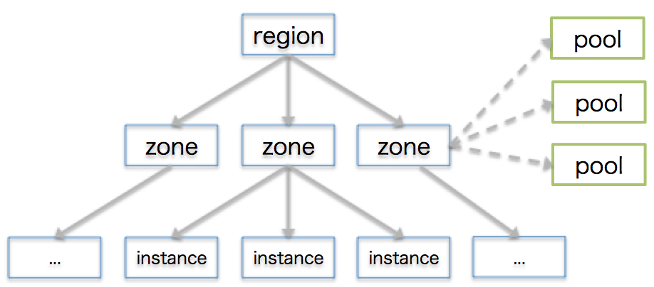
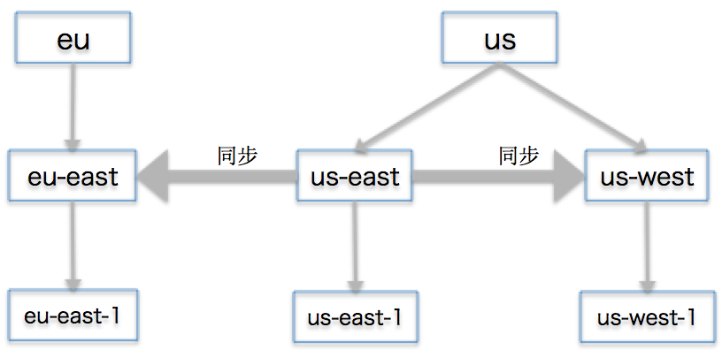

# 使用ceph联盟网关同步域
本文参考了[ceph官方文档](http://docs.ceph.com/docs/master/radosgw/federated-config/)的流程。后来发现了也有中文文档[《联盟网关的配置》](http://ceph-doc.imaclouds.com/radosgw/federated-config/)可供参考。

[Ceph对象网关（Ceph Object Gateway，radosgw）](http://docs.ceph.com/docs/master/radosgw/)提供了S3和Swift的API，同时也支持S3的一些概念。[辖区（region）](http://docs.ceph.com/docs/master/radosgw/config-ref/#regions)表明了一个地理位置，比如us。在这个辖区里可以有多个[域（zone）](http://docs.ceph.com/docs/master/radosgw/config-ref/#zones)，比如east和west。一个域里可以有多个实例，一个实例可以有多个[节点（node）](http://docs.ceph.com/docs/master/glossary/#term-ceph-node)。同时，配置一个域需要一系列的[存储池（pool）](http://docs.ceph.com/docs/master/radosgw/config-ref/#pools)。如下图：


对于这个例子，我们使用下图的架构：


一个us辖区里有us-east和us-west两个域，每个域里各有一个实例，分别为us-east-1和us-west-1。还有一个eu的辖区，里面有一个eu-east的域，一个为eu-east-1的实例。假设我们有三台虚拟机，一台叫做**us-east**，它的IP是**192.168.33.15**；另一台叫做**us-west**，它的IP是**192.168.33.16**；第三台叫做**eu-east**，它的IP是**192.168.33.17**，分别扮演着这三个实例所在的三个节点的角色。

我们将会首先实现同一个辖区（us）里的同步，然后是不同辖区的同步。相同辖区可以同步元数据和数据对象，而不同的辖区只能同步元数据而不能同步数据对象。元数据包括网关用户和存储桶（bucket）。

## 相同辖区的同步
首先需要在全部三台虚拟机安装一些ceph、radosgw的依赖包：
```sh
sudo apt-get update
sudo apt-get -y --force-yes install ceph-common radosgw radosgw-agent
```

为了提供HTTP服务，还需要所有三台虚拟机都安装apache2（Red Hat系是httpd）和FastCGI：
```sh
sudo apt-get -y --force-yes install apache2 libapache2-mod-fastcgi
```

相同辖区同步暂时不需要考虑eu-east这台虚拟机。然后就可以分别启动ceph/demo这个容器来提供ceph服务。
us-east：
```sh
docker run -d --net=host -v /etc/ceph:/etc/ceph -e MON_IP=192.168.33.15 -e CEPH_NETWORK=192.168.33.15/24 --name=ceph ceph/demo
```

us-west
```sh
docker run -d --net=host -v /etc/ceph:/etc/ceph -e MON_IP=192.168.33.16 -e CEPH_NETWORK=192.168.33.16/24 --name=ceph ceph/demo
```

然后手动在各自虚拟机上创建一些提供给域使用的存储池，这一步不是必须的，因为我们创建的网关用户有权限自动创建存储池。
us-east：
```sh
docker exec -it ceph bash
ceph osd pool create .us-east.rgw.root 16 16
ceph osd pool create .us-east.rgw.control 16 16
ceph osd pool create .us-east.rgw.gc 16 16
ceph osd pool create .us-east.rgw.buckets 512 512
ceph osd pool create .us-east.rgw.buckets.index 32 32
ceph osd pool create .us-east.rgw.buckets.extra 16 16
ceph osd pool create .us-east.log 16 16
ceph osd pool create .us-east.intent-log 16 16
ceph osd pool create .us-east.usage 16 16
ceph osd pool create .us-east.users 16 16
ceph osd pool create .us-east.users.email 16 16
ceph osd pool create .us-east.users.swift 16 16
ceph osd pool create .us-east.users.uid 16 16
exit
```

us-west：
```sh
docker exec -it ceph bash
ceph osd pool create .us-west.rgw.root 16 16
ceph osd pool create .us-west.rgw.control 16 16
ceph osd pool create .us-west.rgw.gc 16 16
ceph osd pool create .us-west.rgw.buckets 512 512
ceph osd pool create .us-west.rgw.buckets.index 32 32
ceph osd pool create .us-west.rgw.buckets.extra 16 16
ceph osd pool create .us-west.log 16 16
ceph osd pool create .us-west.intent-log 16 16
ceph osd pool create .us-west.usage 16 16
ceph osd pool create .us-west.users 16 16
ceph osd pool create .us-west.users.email 16 16
ceph osd pool create .us-west.users.swift 16 16
ceph osd pool create .us-west.users.uid 16 16
exit
```

两台虚拟机对应两个实例，接下来为这两个实例分别创建密钥环（keyring），用它生成网关的用户和密钥（key），增加密钥的rwx权限并让其有权限访问Ceph对象集群。
us-east：
```sh
sudo ceph auth del client.radosgw.gateway
sudo ceph-authtool --create-keyring /etc/ceph/ceph.client.radosgw.keyring
sudo chmod +r /etc/ceph/ceph.client.radosgw.keyring
sudo ceph-authtool /etc/ceph/ceph.client.radosgw.keyring -n client.radosgw.us-east-1 --gen-key
sudo ceph-authtool -n client.radosgw.us-east-1 --cap osd 'allow rwx' --cap mon 'allow rw' /etc/ceph/ceph.client.radosgw.keyring
sudo ceph -k /etc/ceph/ceph.client.admin.keyring auth add client.radosgw.us-east-1 -i /etc/ceph/ceph.client.radosgw.keyring
```

us-west：
```sh
sudo ceph auth del client.radosgw.gateway
sudo ceph-authtool --create-keyring /etc/ceph/ceph.client.radosgw.keyring
sudo chmod +r /etc/ceph/ceph.client.radosgw.keyring
sudo ceph-authtool /etc/ceph/ceph.client.radosgw.keyring -n client.radosgw.us-west-1 --gen-key
sudo ceph-authtool -n client.radosgw.us-west-1 --cap osd 'allow rwx' --cap mon 'allow rw' /etc/ceph/ceph.client.radosgw.keyring
sudo ceph -k /etc/ceph/ceph.client.admin.keyring auth add client.radosgw.us-west-1 -i /etc/ceph/ceph.client.radosgw.keyring
```

接下来创建一个apache2的配置文件，监听80端口并把请求转发到radosgw提供的FastCGI 9000端口（稍后将会配置）上。
us-east和us-west：
```sh
cat << EOF > rgw.conf
FastCgiExternalServer /var/www/s3gw.fcgi -host localhost:9000

<VirtualHost *:80>
    ServerName localhost
    ServerAlias *.localhost
    ServerAdmin someone@hw.com
    DocumentRoot /var/www
    RewriteEngine On
    RewriteRule  ^/(.*) /s3gw.fcgi?%{QUERY_STRING} [E=HTTP_AUTHORIZATION:%{HTTP:Authorization},L]

    <IfModule mod_fastcgi.c>
           <Directory /var/www>
            Options +ExecCGI
            AllowOverride All
            SetHandler fastcgi-script
            Order allow,deny
            Allow from all
            AuthBasicAuthoritative Off
        </Directory>
    </IfModule>

    AllowEncodedSlashes On
    ErrorLog /var/log/apache2/error.log
    CustomLog /var/log/apache2/access.log combined
    ServerSignature Off
</VirtualHost>
EOF

sudo mv rgw.conf /etc/apache2/conf-enabled/rgw.conf
```

由于上述配置需要用到apache2默认未加载的[rewrite模块](http://httpd.apache.org/docs/current/mod/mod_rewrite.html)，所以需要加载并重新启动apache2。
us-east和us-west：
```sh
sudo a2enmod rewrite
sudo service apache2 restart
```

FastCGI需要一个脚本来启用兼容S3的接口，同样也是所有虚拟机都要配，但是实例名略有区别。
us-east：
```sh
cat << EOF > s3gw.fcgi
#!/bin/sh
exec /usr/bin/radosgw -c /etc/ceph/ceph.conf -n client.radosgw.us-east-1
EOF

sudo mv s3gw.fcgi /var/www/s3gw.fcgi
sudo chmod +x /var/www/s3gw.fcgi
```

us-west：
```sh
cat << EOF > s3gw.fcgi
#!/bin/sh
exec /usr/bin/radosgw -c /etc/ceph/ceph.conf -n client.radosgw.us-west-1
EOF

sudo mv s3gw.fcgi /var/www/s3gw.fcgi
sudo chmod +x /var/www/s3gw.fcgi
```

现在可以修改`ceph.conf`配置实例了。
us-east：
```sh
sudo sed -i '$a rgw region root pool = .us.rgw.root' /etc/ceph/ceph.conf
sudo sed -i '$a rgw zonegroup root pool = .us.rgw.root' /etc/ceph/ceph.conf
sudo sed -i $'$a \\\n' /etc/ceph/ceph.conf
sudo sed -i '$a [client.radosgw.us-east-1]' /etc/ceph/ceph.conf
sudo sed -i '$a rgw region = us' /etc/ceph/ceph.conf
sudo sed -i '$a rgw zone = us-east' /etc/ceph/ceph.conf
sudo sed -i '$a rgw zone root pool = .us-east.rgw.root' /etc/ceph/ceph.conf
sudo sed -i '$a rgw dns name = us-east' /etc/ceph/ceph.conf
sudo sed -i '$a host = us-east' /etc/ceph/ceph.conf
sudo sed -i '$a keyring = /etc/ceph/ceph.client.radosgw.keyring' /etc/ceph/ceph.conf
sudo sed -i '$a rgw socket path = ""' /etc/ceph/ceph.conf
sudo sed -i '$a log file = /var/log/radosgw/client.radosgw.us-east-1.log' /etc/ceph/ceph.conf
sudo sed -i '$a rgw frontends = fastcgi socket_port=9000 socket_host=0.0.0.0' /etc/ceph/ceph.conf
sudo sed -i '$a rgw print continue = false' /etc/ceph/ceph.conf
sudo sed -i $'$a \\\n' /etc/ceph/ceph.conf
```

us-west：
```sh
sudo sed -i '$a rgw region root pool = .us.rgw.root' /etc/ceph/ceph.conf
sudo sed -i '$a rgw zonegroup root pool = .us.rgw.root' /etc/ceph/ceph.conf
sudo sed -i $'$a \\\n' /etc/ceph/ceph.conf
sudo sed -i '$a [client.radosgw.us-west-1]' /etc/ceph/ceph.conf
sudo sed -i '$a rgw region = us' /etc/ceph/ceph.conf
sudo sed -i '$a rgw zone = us-west' /etc/ceph/ceph.conf
sudo sed -i '$a rgw zone root pool = .us-west.rgw.root' /etc/ceph/ceph.conf
sudo sed -i '$a rgw dns name = us-west' /etc/ceph/ceph.conf
sudo sed -i '$a host = us-west' /etc/ceph/ceph.conf
sudo sed -i '$a keyring = /etc/ceph/ceph.client.radosgw.keyring' /etc/ceph/ceph.conf
sudo sed -i '$a rgw socket path = ""' /etc/ceph/ceph.conf
sudo sed -i '$a log file = /var/log/radosgw/client.radosgw.us-west-1.log' /etc/ceph/ceph.conf
sudo sed -i '$a rgw frontends = fastcgi socket_port=9000 socket_host=0.0.0.0' /etc/ceph/ceph.conf
sudo sed -i '$a rgw print continue = false' /etc/ceph/ceph.conf
```

配置参数及其作用可以在[这里](http://docs.ceph.com/docs/master/radosgw/config-ref/)查到，下面列出了一部分与辖区和域有关的参数：
- **rgw region root pool**：v.67版本中指定辖区所使用的存储池
- **rgw zonegroup root pool**：Jewel版本中指定辖区所使用的存储池
- **rgw region**：指定该实例的辖区名
- **rgw zone**：指定该实例的域名
- **rgw zone root pool**：指定域所使用的存储池

接下来在各自实例上生成一个相同的json格式的辖区文件。
us-east和us-west：
```sh
docker exec -it ceph bash
cat << EOF > us.json
{
  "name": "us",
  "api_name": "us",
  "is_master": "true",
  "endpoints": ["http:\/\/192.168.33.15:80\/"],
  "master_zone": "us-east",
  "zones": [
    {
      "name": "us-east",
      "endpoints": ["http:\/\/192.168.33.15:80\/"],
      "log_meta": "true",
      "log_data": "true"
    },
    {
      "name": "us-west",
      "endpoints": ["http:\/\/192.168.33.16:80\/"],
      "log_meta": "true",
      "log_data": "true"
    }
  ],
  "placement_targets": [
   {
     "name": "default-placement",
     "tags": []
   }
  ],
  "default_placement": "default-placement"
}
EOF
exit
```

然后通过辖区文件生成us辖区并设置其为默认辖区。
us-east：
```sh
docker exec -it ceph bash
radosgw-admin region set --infile us.json --name client.radosgw.us-east-1
radosgw-admin region default --rgw-region=us --name client.radosgw.us-east-1
radosgw-admin regionmap update --name client.radosgw.us-east-1
exit
```

us-west：
```sh
docker exec -it ceph bash
radosgw-admin region set --infile us.json --name client.radosgw.us-west-1
radosgw-admin region default --rgw-region=us --name client.radosgw.us-west-1
radosgw-admin regionmap update --name client.radosgw.us-west-1
exit
```

接下来是域。在各自实例上生成两个相同的json格式的域文件。
us-east和us-west：
```sh
docker exec -it ceph bash
cat << EOF > us-east.json
{
  "domain_root": ".us-east.domain.rgw",
  "control_pool": ".us-east.rgw.control",
  "gc_pool": ".us-east.rgw.gc",
  "log_pool": ".us-east.log",
  "intent_log_pool": ".us-east.intent-log",
  "usage_log_pool": ".us-east.usage",
  "user_keys_pool": ".us-east.users",
  "user_email_pool": ".us-east.users.email",
  "user_swift_pool": ".us-east.users.swift",
  "user_uid_pool": ".us-east.users.uid",
  "system_key": {
    "access_key": "",
    "secret_key": ""
  },
  "placement_pools": [
    {
      "key": "default-placement",
      "val": {
        "index_pool": ".us-east.rgw.buckets.index",
        "data_pool": ".us-east.rgw.buckets"
      }
    }
  ]
}
EOF

sed 's/east/west/g' us-east.json > us-west.json
exit
```

然后通过域文件生成两个域并更新辖区图（region map）。
us-east：
```sh
docker exec -it ceph bash
radosgw-admin zone set --rgw-zone=us-east --infile us-east.json --name client.radosgw.us-east-1
radosgw-admin zone set --rgw-zone=us-west --infile us-west.json --name client.radosgw.us-east-1
radosgw-admin regionmap update --name client.radosgw.us-east-1
exit
```

us-west：
```sh
docker exec -it ceph bash
radosgw-admin zone set --rgw-zone=us-east --infile us-east.json --name client.radosgw.us-west-1
radosgw-admin zone set --rgw-zone=us-west --infile us-west.json --name client.radosgw.us-west-1
radosgw-admin regionmap update --name client.radosgw.us-west-1
exit
```

在`us-east-1`实例上，生成`us-east`的用户，并用生成的`access_key`和`secret_key`填充刚才为空的`us-east.json`文件，并将其复制到`us-west`虚拟机上：
```sh
docker exec -it ceph bash
radosgw-admin user create --uid="us-east" --display-name="Region-US Zone-East" --name client.radosgw.us-east-1 --system | tee eastuser.txt
export SRC_ACCESS_KEY=`sed -n 's/ *"access_key": "\(.*\)",/\1/p' eastuser.txt`
export SRC_SECRET_KEY=`sed -n 's/ *"secret_key": "\(.*\)"/\1/p' eastuser.txt`
sed -i "s/access_key\": \"/access_key\": \"$SRC_ACCESS_KEY/g" us-east.json
sed -i "s/secret_key\": \"/secret_key\": \"$SRC_SECRET_KEY/g" us-east.json
exit

docker cp ceph:us-east.json us-east.json
scp us-east.json root@192.168.33.16:/root
```

在`us-west-1`实例上，生成`us-west`的用户，也用生成的`access_key`和`secret_key`填充刚才为空的`us-west.json`文件，并将其复制到`us-east`虚拟机上：
```sh
docker exec -it ceph bash
radosgw-admin user create --uid="us-west" --display-name="Region-US Zone-West" --name client.radosgw.us-west-1 --system | tee westuser.txt
export DEST_ACCESS_KEY=`sed -n 's/ *"access_key": "\(.*\)",/\1/p' westuser.txt`
export DEST_SECRET_KEY=`sed -n 's/ *"secret_key": "\(.*\)"/\1/p' westuser.txt`
sed -i "s/access_key\": \"/access_key\": \"$DEST_ACCESS_KEY/g" us-west.json
sed -i "s/secret_key\": \"/secret_key\": \"$DEST_SECRET_KEY/g" us-west.json
exit

docker cp ceph:us-west.json us-west.json
scp us-west.json root@192.168.33.15:/root
```

现在两台虚拟机的用户主文件夹里都有对方的json文件，分别复制进ceph容器里。
us-east：
```sh
docker cp us-west.json ceph:/us-west.json
```

us-west：
```sh
docker cp us-east.json ceph:/us-east.json
```

接下来分别在两个实例里更新带了`access_key`和`secret_key`的各两个域。
us-east：
```sh
docker exec ceph radosgw-admin zone set --rgw-zone=us-east --infile us-east.json --name client.radosgw.us-east-1
docker exec ceph radosgw-admin zone set --rgw-zone=us-west --infile us-west.json --name client.radosgw.us-east-1
```

us-west：
```sh
docker exec ceph radosgw-admin zone set --rgw-zone=us-east --infile us-east.json --name client.radosgw.us-west-1
docker exec ceph radosgw-admin zone set --rgw-zone=us-west --infile us-west.json --name client.radosgw.us-west-1
```

都完成了以后，就可以重启ceph服务和apache2啦。
us-east和us-west：
```sh
docker restart ceph
sudo /etc/init.d/radosgw start
sudo service apache2 restart
```

Apache2启动完成后，在浏览器打开[http://192.168.33.15/](http://192.168.33.15/)或[http://192.168.33.16/](http://192.168.33.16/)应该能看到下面的xml：
```xml
<ListAllMyBucketsResult xmlns="http://s3.amazonaws.com/doc/2006-03-01/">
  <Owner>
    <ID>anonymous</ID>
    <DisplayName/>
  </Owner>
  <Buckets/>
</ListAllMyBucketsResult>
```

如果只看到了500的错误，等半分钟再刷新一次即可。如果遇到麻烦，可以这样调试：输入命令`sudo lsof -i :9000`看看是否radosgw启动了这个端口。如果没有，输入命令`ps -ef | grep radosgw`看看radosgw是否正常启动。若是正常启动，应该会有一个`/usr/bin/radosgw -n client.radosgw.us-east-1`的进程。若是没有正常启动，可以检查`/ect/ceph/ceph.conf`的内容，一般都是配置有问题。

接下来在`us-east`里用python的boto库给`us-east-1`实例创建一个名为`my-new-bucket`的存储桶，并给`hw`的key上传一句**Hello world**：
```sh
export SRC_ACCESS_KEY=`sed -n 's/ *"access_key": "\(.*\)",/\1/p' us-east.json`
export SRC_SECRET_KEY=`sed -n 's/ *"secret_key": "\(.*\)"/\1/p' us-east.json`

cat << EOF > s3test.py
import boto
import boto.s3
import boto.s3.connection
import os
from boto.s3.key import Key

access_key = os.environ["SRC_ACCESS_KEY"]
secret_key = os.environ["SRC_SECRET_KEY"]
conn = boto.connect_s3(
  aws_access_key_id = access_key,
  aws_secret_access_key = secret_key,
  host = '192.168.33.15',
  is_secure=False,
  calling_format = boto.s3.connection.OrdinaryCallingFormat(),
)
bucket = conn.create_bucket('my-new-bucket')

k = Key(bucket)
k.key = 'hw'
k.set_contents_from_string('Hello world')

for bucket in conn.get_all_buckets():
  print "{name}\t{created}".format(
    name = bucket.name,
    created = bucket.creation_date,
)
EOF

python s3test.py
```

现在可以在`us-west`里启动`radosgw-agent`来同步数据了：
```sh
export SRC_ACCESS_KEY=`sed -n 's/ *"access_key": "\(.*\)",/\1/p' us-east.json`
export SRC_SECRET_KEY=`sed -n 's/ *"secret_key": "\(.*\)"/\1/p' us-east.json`
export DEST_ACCESS_KEY=`sed -n 's/ *"access_key": "\(.*\)",/\1/p' us-west.json`
export DEST_SECRET_KEY=`sed -n 's/ *"secret_key": "\(.*\)"/\1/p' us-west.json`

cat << EOF > cluster-data-sync.conf
src_zone: us-east
source: http://192.168.33.15
src_access_key: $SRC_ACCESS_KEY
src_secret_key: $SRC_SECRET_KEY
dest_zone: us-west
destination: http://192.168.33.16
dest_access_key: $DEST_ACCESS_KEY
dest_secret_key: $DEST_SECRET_KEY
log_file: /var/log/radosgw/radosgw-sync-us-east-west.log
EOF

sudo radosgw-agent -c cluster-data-sync.conf
```

再打开一个终端窗口，用以下命令查看`us-west-1`实例是不是已经把`my-new-bucket`同步过来啦：
```sh
docker exec ceph radosgw-admin metadata bucket list --name client.radosgw.us-west-1
```

可能是由于单机`ceph/demo`容器的性能极差，在同步对象的时候基本上就一直停在**INFO:radosgw_agent.worker:syncing bucket "my-new-bucket"**上。如果有真实环境的ceph应该能够很快同步过来。如果同步成功，可以在`us-west`里用以下命令来得到刚才的**Hello world**：
```sh
cat << EOF > s3download.py
import boto
import boto.s3
import boto.s3.connection
import os
from boto.s3.key import Key

access_key = os.environ["SRC_ACCESS_KEY"]
secret_key = os.environ["SRC_SECRET_KEY"]
conn = boto.connect_s3(
  aws_access_key_id = access_key,
  aws_secret_access_key = secret_key,
  host = '192.168.33.16',
  is_secure=False,
  calling_format = boto.s3.connection.OrdinaryCallingFormat(),
)
bucket = conn.get_bucket('my-new-bucket')

key = bucket.get_key('hw')
print key.get_contents_as_string()
EOF

python s3download.py
```

## 不同辖区的同步
不同的辖区只能同步元数据而不能同步数据对象。接下来我们在eu-east上，尝试同步us-east的元数据。有了[相同辖区的同步](/ceph-radosgw-replication/#u76F8_u540C_u8F96_u533A_u7684_u540C_u6B65)的经验，这回就不详细介绍下面的命令了。以下命令运行在`eu-east`上：
```sh
docker run -d --net=host -v /etc/ceph:/etc/ceph -e MON_IP=192.168.33.17 -e CEPH_NETWORK=192.168.33.17/24 --name=ceph ceph/demo

# 创建存储池这一步也同上面一样是可选
docker exec -it ceph bash
ceph osd pool create .eu-east.rgw.root 16 16
ceph osd pool create .eu-east.rgw.control 16 16
ceph osd pool create .eu-east.rgw.gc 16 16
ceph osd pool create .eu-east.rgw.buckets 512 512
ceph osd pool create .eu-east.rgw.buckets.index 32 32
ceph osd pool create .eu-east.rgw.buckets.extra 16 16
ceph osd pool create .eu-east.log 16 16
ceph osd pool create .eu-east.intent-log 16 16
ceph osd pool create .eu-east.usage 16 16
ceph osd pool create .eu-east.users 16 16
ceph osd pool create .eu-east.users.email 16 16
ceph osd pool create .eu-east.users.swift 16 16
ceph osd pool create .eu-east.users.uid 16 16
exit

# 创建密钥环和网关用户
sudo ceph auth del client.radosgw.gateway
sudo ceph-authtool --create-keyring /etc/ceph/ceph.client.radosgw.keyring
sudo chmod +r /etc/ceph/ceph.client.radosgw.keyring
sudo ceph-authtool /etc/ceph/ceph.client.radosgw.keyring -n client.radosgw.eu-east-1 --gen-key
sudo ceph-authtool -n client.radosgw.eu-east-1 --cap osd 'allow rwx' --cap mon 'allow rw' /etc/ceph/ceph.client.radosgw.keyring
sudo ceph -k /etc/ceph/ceph.client.admin.keyring auth add client.radosgw.eu-east-1 -i /etc/ceph/ceph.client.radosgw.keyring

# 配置apache2
cat << EOF > rgw.conf
FastCgiExternalServer /var/www/s3gw.fcgi -host localhost:9000

<VirtualHost *:80>

    ServerName localhost
    ServerAlias *.localhost
    ServerAdmin someone@hw.com
    DocumentRoot /var/www
    RewriteEngine On
    RewriteRule  ^/(.*) /s3gw.fcgi?%{QUERY_STRING} [E=HTTP_AUTHORIZATION:%{HTTP:Authorization},L]

    <IfModule mod_fastcgi.c>
           <Directory /var/www>
            Options +ExecCGI
            AllowOverride All
            SetHandler fastcgi-script
            Order allow,deny
            Allow from all
            AuthBasicAuthoritative Off
        </Directory>
    </IfModule>

    AllowEncodedSlashes On
    ErrorLog /var/log/apache2/error.log
    CustomLog /var/log/apache2/access.log combined
    ServerSignature Off

</VirtualHost>
EOF

sudo mv rgw.conf /etc/apache2/conf-enabled/rgw.conf

# 配置FastCGI
cat << EOF > s3gw.fcgi
#!/bin/sh
exec /usr/bin/radosgw -c /etc/ceph/ceph.conf -n client.radosgw.eu-east-1
EOF

sudo mv s3gw.fcgi /var/www/s3gw.fcgi
sudo chmod +x /var/www/s3gw.fcgi

# 配置ceph
sudo sed -i '$a rgw region root pool = .eu.rgw.root' /etc/ceph/ceph.conf
sudo sed -i '$a rgw zonegroup root pool = .eu.rgw.root' /etc/ceph/ceph.conf
sudo sed -i $'$a \\\n' /etc/ceph/ceph.conf
sudo sed -i '$a [client.radosgw.eu-east-1]' /etc/ceph/ceph.conf
sudo sed -i '$a rgw region = eu' /etc/ceph/ceph.conf
sudo sed -i '$a rgw zone = eu-east' /etc/ceph/ceph.conf
sudo sed -i '$a rgw zone root pool = .eu-east.rgw.root' /etc/ceph/ceph.conf
sudo sed -i '$a rgw dns name = eu-east' /etc/ceph/ceph.conf
sudo sed -i '$a host = eu-east' /etc/ceph/ceph.conf
sudo sed -i '$a keyring = /etc/ceph/ceph.client.radosgw.keyring' /etc/ceph/ceph.conf
sudo sed -i '$a rgw socket path = ""' /etc/ceph/ceph.conf
sudo sed -i '$a log file = /var/log/radosgw/client.radosgw.eu-east-1.log' /etc/ceph/ceph.conf
sudo sed -i '$a rgw frontends = fastcgi socket_port=9000 socket_host=0.0.0.0' /etc/ceph/ceph.conf
sudo sed -i '$a rgw print continue = false' /etc/ceph/ceph.conf
sudo sed -i $'$a \\\n' /etc/ceph/ceph.conf
```

接下来就是辖区和域的配置了。需要设置us的辖区和eu自己的辖区，否则会报错：**AssertionError: No master zone found for region default**。但是域只用设置eu自己的就好：
```sh
docker exec -it ceph bash

cat << EOF > us.json
{
  "name": "us",
  "api_name": "us",
  "is_master": "true",
  "endpoints": ["http:\/\/192.168.33.15:80\/"],
  "master_zone": "us-east",
  "zones": [
    {
      "name": "us-east",
      "endpoints": ["http:\/\/192.168.33.15:80\/"],
      "log_meta": "true",
      "log_data": "true"
    },
    {
      "name": "us-west",
      "endpoints": ["http:\/\/192.168.33.16:80\/"],
      "log_meta": "true",
      "log_data": "true"
    }
  ],
  "placement_targets": [
   {
     "name": "default-placement",
     "tags": []
   }
  ],
  "default_placement": "default-placement"
}
EOF

cat << EOF > eu.json
{
  "name": "eu",
  "api_name": "eu",
  "is_master": "false",
  "endpoints": ["http:\/\/192.168.33.15:80\/"],
  "master_zone": "eu-east",
  "zones": [
    {
      "name": "eu-east",
      "endpoints": ["http:\/\/192.168.33.17:80\/"],
      "log_meta": "true",
      "log_data": "true"
    }
  ],
  "placement_targets": [
   {
     "name": "default-placement",
     "tags": []
   }
  ],
  "default_placement": "default-placement"
}
EOF

# 设置辖区
radosgw-admin region set --infile us.json --name client.radosgw.eu-east-1
radosgw-admin regionmap update --name client.radosgw.eu-east-1

radosgw-admin region set --infile eu.json --name client.radosgw.eu-east-1
radosgw-admin region default --rgw-region=eu --name client.radosgw.eu-east-1
radosgw-admin regionmap update --name client.radosgw.eu-east-1

cat << EOF > eu-east.json
{
  "domain_root": ".eu-east.domain.rgw",
  "control_pool": ".eu-east.rgw.control",
  "gc_pool": ".eu-east.rgw.gc",
  "log_pool": ".eu-east.log",
  "intent_log_pool": ".eu-east.intent-log",
  "usage_log_pool": ".eu-east.usage",
  "user_keys_pool": ".eu-east.users",
  "user_email_pool": ".eu-east.users.email",
  "user_swift_pool": ".eu-east.users.swift",
  "user_uid_pool": ".eu-east.users.uid",
  "system_key": {
    "access_key": "",
    "secret_key": ""
  },
  "placement_pools": [
    {
      "key": "default-placement",
      "val": {
        "index_pool": ".eu-east.rgw.buckets.index",
        "data_pool": ".eu-east.rgw.buckets"
      }
    }
  ]
}
EOF

# 设置域
radosgw-admin zone set --rgw-zone=eu-east --infile eu-east.json --name client.radosgw.eu-east-1
radosgw-admin regionmap update --name client.radosgw.eu-east-1

# 创建用户
radosgw-admin user create --uid="eu-east" --display-name="Region-EU Zone-East" --name client.radosgw.eu-east-1 --system | tee eastuser.txt
export SRC_ACCESS_KEY=`sed -n 's/ *"access_key": "\(.*\)",/\1/p' eastuser.txt`
export SRC_SECRET_KEY=`sed -n 's/ *"secret_key": "\(.*\)"/\1/p' eastuser.txt`
sed -i "s/access_key\": \"/access_key\": \"$SRC_ACCESS_KEY/g" eu-east.json
sed -i "s/secret_key\": \"/secret_key\": \"$SRC_SECRET_KEY/g" eu-east.json

radosgw-admin zone set --rgw-zone=eu-east --infile eu-east.json --name client.radosgw.eu-east-1

exit
```

可以重启`eu-east`的ceph服务和apache2了：
```sh
docker restart ceph
sudo /etc/init.d/radosgw start
sudo a2enmod rewrite
sudo service apache2 restart
```

最后同步元数据：
```sh
scp root@192.168.33.15:/root/us-east.json .

docker cp ceph:eu-east.json eu-east.json
export SRC_ACCESS_KEY=`sed -n 's/ *"access_key": "\(.*\)",/\1/p' us-east.json`
export SRC_SECRET_KEY=`sed -n 's/ *"secret_key": "\(.*\)"/\1/p' us-east.json`
export DEST_ACCESS_KEY=`sed -n 's/ *"access_key": "\(.*\)",/\1/p' eu-east.json`
export DEST_SECRET_KEY=`sed -n 's/ *"secret_key": "\(.*\)"/\1/p' eu-east.json`

cat << EOF > cluster-data-sync.conf
src_zone: us-east
source: http://192.168.33.15
src_access_key: $SRC_ACCESS_KEY
src_secret_key: $SRC_SECRET_KEY
dest_zone: eu-east
destination: http://192.168.33.17
dest_access_key: $DEST_ACCESS_KEY
dest_secret_key: $DEST_SECRET_KEY
log_file: /var/log/radosgw/radosgw-sync-eu-east-west.log
EOF

sudo radosgw-agent -c cluster-data-sync.conf --metadata-only
```

如果不加`--metadata-only`，则会报错：**ERROR:root:data sync can only occur between zones in the same region**。同步完成后，运行以下命令查看现在`eu-east-1`实例里的存储桶：
```sh
docker exec ceph radosgw-admin metadata bucket list --name client.radosgw.eu-east-1
```

就能够看到先前在`us-east-1`创建的`my-new-bucket`存储桶了。
